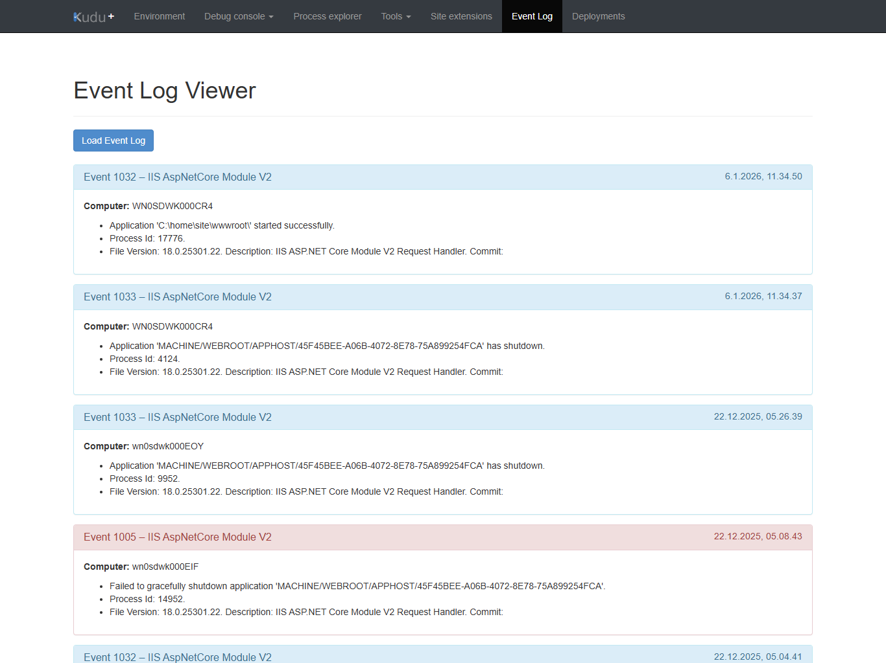
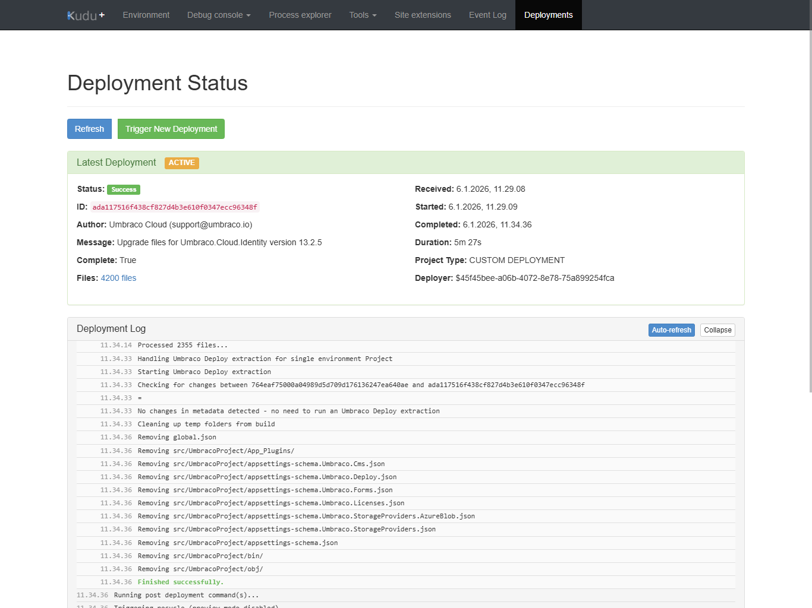
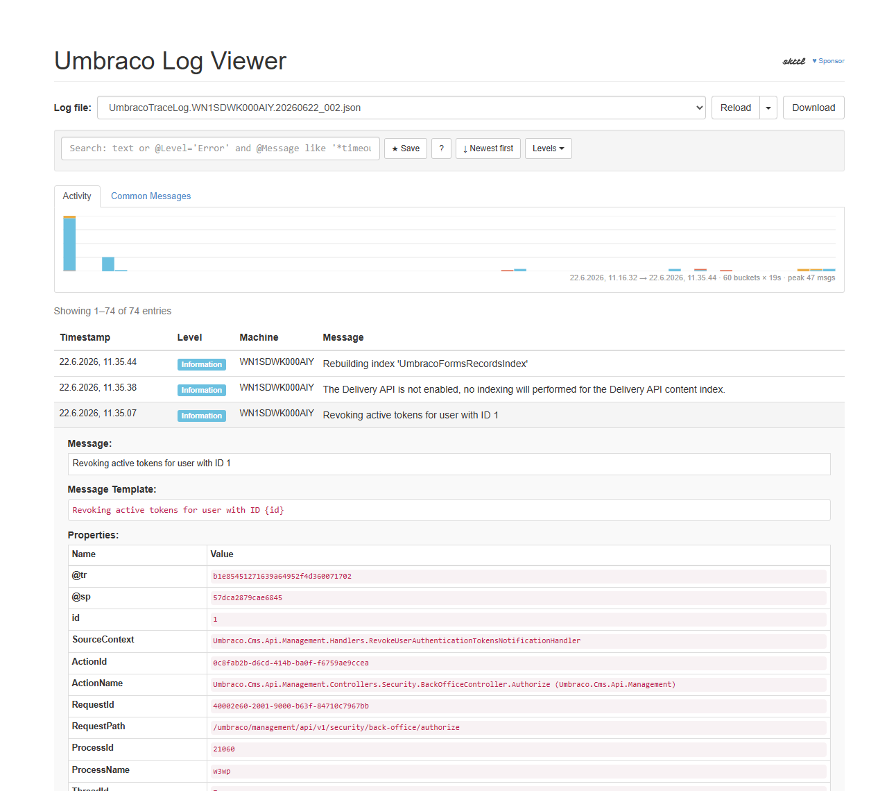

# Umbraco Cloud Kudu Userscripts

A collection of userscripts that enhance the Kudu interface for Umbraco Cloud environments with additional monitoring and deployment tools.

## Scripts

| Script | Version | Description | Install |
|--------|---------|-------------|---------|
| [Kudu Event Log Viewer](docs/kudu-eventlog-viewer/README.md) | v1.1.0 | Browse Windows Event Logs inside Kudu |  |
| [Umbraco Cloud Deployment Viewer](docs/umbraco-deployment-viewer/README.md) | v1.1.0 | Monitor deployments, view live logs, and trigger new deployments |  |
| [Kudu Umbraco Log Viewer](docs/kudu-umbraco-log-viewer/README.md) | v1.1.0 | Browse Serilog JSON log files with filtering, momentum graph, and pagination |  |

## Screenshots

## Installation

These scripts are designed to be used with a userscript manager browser extension.

### Prerequisites

Install a userscript manager extension for your browser:
- **Chrome/Edge**: [Tampermonkey](https://www.tampermonkey.net/)
- **Firefox**: [Tampermonkey](https://www.tampermonkey.net/) or [Greasemonkey](https://www.greasespot.net/)
- **Safari**: [Userscripts](https://github.com/quoid/userscripts)

### Quick Install (Recommended)

1. Install a userscript manager (see prerequisites above)
2. Click the **Install** button in the table above for the script you want
3. Your userscript manager will open with the script ready to install
4. Click "Install" or "Confirm" in your userscript manager
5. Navigate to your Umbraco Cloud Kudu interface to see the new features

### Manual Install

1. Install a userscript manager (see prerequisites above)
2. Click on the userscript manager icon in your browser
3. Select "Create a new script" or "Add new script"
4. Copy the contents of the desired script file from the `scripts/` folder
5. Paste into the userscript editor and save
6. Navigate to your Umbraco Cloud Kudu interface to see the new features

## Compatibility

- **Target Environment**: Umbraco Cloud Kudu (all regions: `*.scm.*.umbraco.io`)
- **Browser Support**: All modern browsers with userscript manager support
- **Dependencies**: None (uses native browser APIs and Kudu's existing Bootstrap CSS)

## Script Coordination

All scripts work together seamlessly:
- They communicate via custom `viewer-change` events to avoid conflicts
- Only one viewer is active at a time
- Switching between viewers properly hides/shows content
- All support browser history navigation without interference

## License

These userscripts are provided as-is for use with Umbraco Cloud environments.
