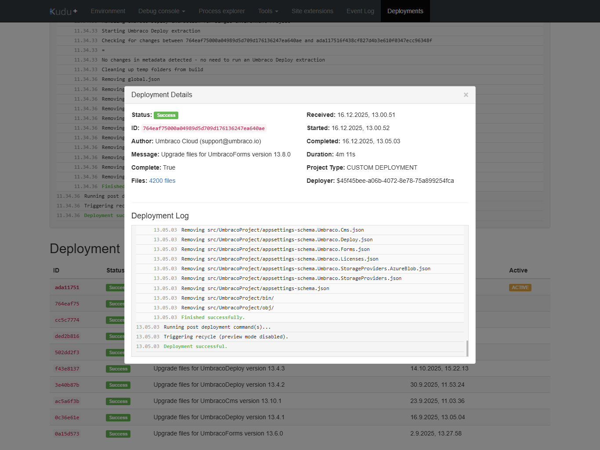
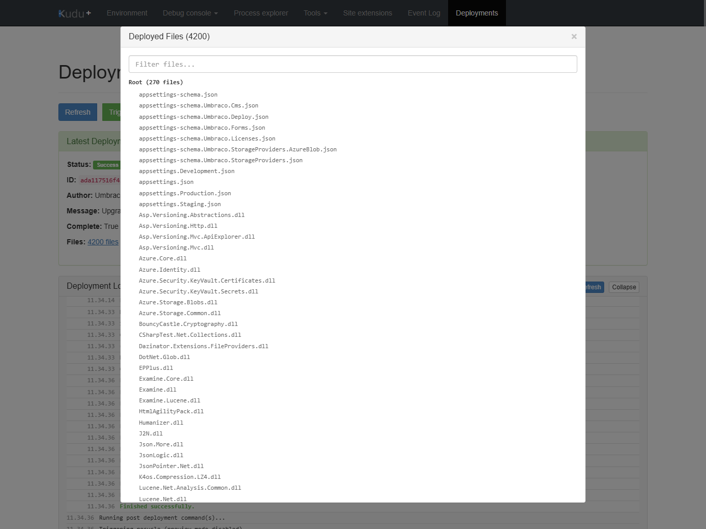

# Umbraco Cloud Deployment Viewer

**File:** `scripts/umbraco-deployment-viewer.user.js` — v1.1.1

Provides a comprehensive deployment monitoring interface within Kudu, allowing you to track deployment status, view logs, and trigger new deployments.

## Features

- **Deployment Dashboard**: View latest deployment status and full deployment history
- **Real-time Log Viewer**:
  - Live deployment logs with syntax highlighting
  - Smart auto-refresh capability (5-second intervals)
    - Automatically stops when deployment reaches terminal state (Failed/Success)
    - Only refreshes during active states (Pending, Building, Deploying)
    - Updates deployment status in real-time during refresh
  - Collapsible log panel
  - Color-coded log messages (errors, warnings, success)
- **Deployment Details**:
  - Status tracking (Pending, Building, Deploying, Failed, Success)
  - Author information and commit messages
  - Timestamps (received, started, completed)
  - Duration calculation
  - Active deployment indicator
- **File Manifest Viewer**:
  - View all deployed files
  - Searchable/filterable file list
  - Organized by directory with collapsible sections
  - File count per directory
- **Deployment Triggering**: Trigger new deployments directly from the interface
- **Interactive History Table**: Click any deployment to view full details in a modal
- **URL State Management**: Supports deep linking with `?deployments` query parameter
- **Browser History**: Proper back/forward navigation support

## Screenshots

**Deployment History & Status**

**File Manifest Viewer**

## Usage

1. Navigate to your Umbraco Cloud Kudu interface (e.g., `*.scm.euwest01.umbraco.io`)
2. Click the "Deployments" link in the navbar
3. View the latest deployment status and log
4. Click "Auto-refresh" to enable live log and status updates
   - Auto-refresh will automatically stop when deployment completes or fails
   - Status, duration, and completion time update in real-time
5. Click "Trigger New Deployment" to start a new deployment
6. Click on any deployment in the history table to view details
7. Click file counts to view the deployment manifest

## Technical Details

- **API Endpoints**:
  - `/api/vfs/site/deployments/` — List deployments
  - `/api/vfs/site/deployments/active` — Get active deployment ID
  - `/api/vfs/site/deployments/{id}/status.xml` — Deployment status
  - `/api/vfs/site/deployments/{id}/log.log` — Deployment log
  - `/api/vfs/site/deployments/{id}/manifest` — Deployed files list
  - `/api/deployments` — Trigger new deployment (PUT)
- **Data Formats**: XML (status), plain text (logs, manifest), JSON (deployment list)
- **Auto-refresh**: 5-second polling; stops automatically when status is not Pending, Building, or Deploying

## Troubleshooting

- Check browser console for errors
- Verify API endpoints are accessible
- Check that deployments exist in `/api/vfs/site/deployments/`

## Changelog

### v1.1.1
- Fixed the script not loading: switched from an invalid `@match https://*.scm.*.umbraco.io/*` pattern (mid-host wildcards are not allowed in `@match`) to a glob `@include https://*.scm.*.umbraco.io/*`

### v1.1.0
- Added proper `@author`, `@homepage`, `@supportURL`, `@license`, `@updateURL`, `@downloadURL` metadata
- Switched from `@include` regex to `@match` pattern
- Updated `@description` to mention Umbraco Cloud context

### v1.0.0
- Initial release: deployment dashboard, real-time log viewer with auto-refresh, deployment details, file manifest viewer, deployment triggering, interactive history table, URL state management, browser history support
